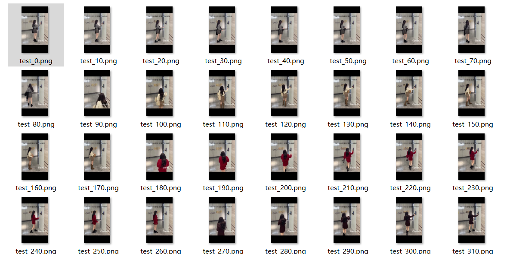

# Video2Image

嗨 ; )     

这是一个基于`Python`的视频转图片小工具，实现了指定间隔的图片提取，但仍存在许多不足与bug。如果发现错误，还请在`Issues`中指出，欢迎`Fork`和`Pull requests`改善代码，谢谢！

[Installation](#Installation) | [Usage](#Usage) | [Example](#Example)

ʕ•̫͡•ʔ-̫͡-ʕ•͓͡•ʕ•̫͡•ʔ-̫͡-ʕ•͓͡•ʔ-̫͡-ʔ

## Installation

该项目使用`Python`开发，运行之前，请确保已经安装好`Python`

[](https://www.python.org/)

[Welcome to Python.org](https://www.python.org/)

1 克隆仓库

```bash
git clone https://github.com/lyh2048/video2Image.git
```

2 进入目录

```bash
cd ./video2Image
```

3 安装依赖

```bash
pip install -r ./requirements.txt
```

Then enjoy the video2Image ~

## Usage

```bash
python ./main.py -input ./input/test.mp4
```


> usage: main.py [-h] -input INPUT [-output OUTPUT] [-interval INTERVAL]
>
> Video2Image
>
> optional arguments:
>
>   -h, --help          show this help message and exit
>
>   -input INPUT        输入视频的路径
>
>   -output OUTPUT      保存位置
>
>   -interval INTERVAL  指定间隔


## Example

```bash
python ./main.py -input ./input/test.mp4 -interval 10
```




